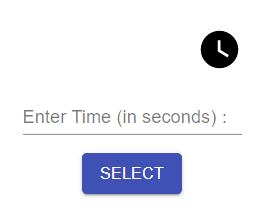

Timer App
===================

Hey!
I have been passionate about Web Development for a while now, so I decided to study this subject, and specialize in it.
The next project, is one of my first steps in React.

--------
Description
-------------
Distance study, due to COVID-19 was not easy. But one of the most useful apps,  is the timer  - we have used it quite a bit.  I decided to make  **one on my own**

Technology Wise
-------------
This mini-project was created purely on client-site, using `React`. The components are purely `functional components` (usage of React hooks). 

> **Note:**

> - ES6 logic
> - Material-ui

How Doe's It Work?
-------------

Enter the number of seconds for performing the countdown.
 You are able to **Pause**, **Start** (from the pause point), and **Reset** (setting to intial time you chode).

> **Note:** The coundown stops at 0.  You can run it again with the same input by pressing "Reset" button.

Prerequisites
--------------------
Packages
npm
react
react-dom

